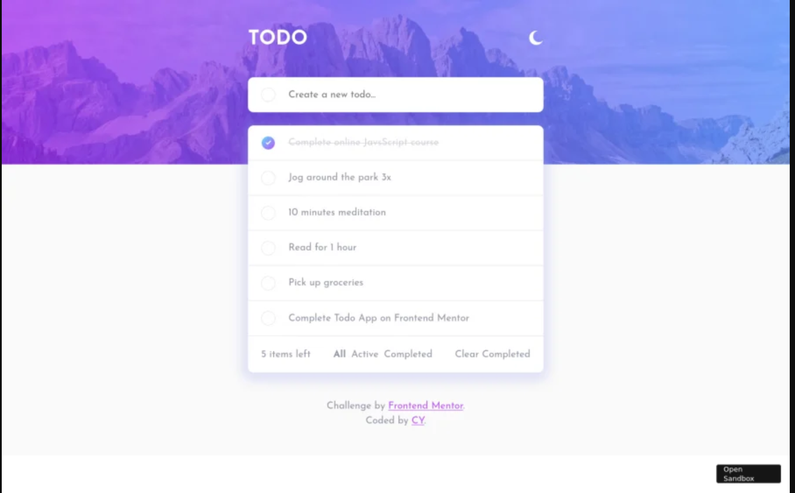

# TODO 系统

## 项目指南
在这个项目中，你将看到以下基于 nestjs 的实践案例 
后端nestjs 提供restful 接口
前端使用react
使用pnpm 编排工作区

服务支持的能力
| 能力       | 名称                                   | 进度  |
| :------------- | -------------------------------------- | :---: |
| **概述**   |                                        |       |
|                | 控制器                             |   ✓   |
|                | 服务和注入                 |   ✓   |
|                | 请求、响应和应用程序     |   ✓   |
|                | Web 中间件                         |   ✓   |
|                | 启动和部署                       |   ✓   |
| **基本能力**   |                                   |       |
|                | 依赖注入                   |   ✓   |
|                | 操作环境                  |   ✓   |
|                | 多环境配置                                             |   ✓   |
|                | 参数校验转换          |   ✓   |
|                | 生命周期                             |   ✓   |
|                | 日志                                 |   ✓   |
|                | 测试                                   |   ✓   |
| **增强**       |                                     |       |
|                | 缓存（Redis）                          |   ✓   |
|                | 数据库（Typegoose）                      |   ✓   |
|                | mysql                                |   ✓   |
|                | Swagger                                |   ✓   |
| **Web**    |                                         |       |
|                |      跨域支持                               |   ✓   |
| **微服务**     |                                         |       |
|                | RabbitMQ                               |      |
| **通用能力**   |                                         |       |
|                | Token 认证                  |   ✓   |
|                | 认证中间件             |   ✓   |
|                | 接口响应统计中间件|   ✓   |
|                | 统一错误处理                  |   ✓   |
|                | Jaeger                                   |   ✓   |


## 前端示例


## 使用

运行此项目需要以下环境支持
- mysql
- Redis
- Jeager

通过 docker 安装依赖
```
docker-compose up -d
docker-compose down
```

初始化db db
```
docker exec -it mongo mongosh admin
use admin
db.auth('admin','admin')
use test
db.createUser({user:'admin',pwd:'123456',roles:[{role:'readWrite',db:'test'}]})

```

### 开发

```bash
$ pnpm i
# 同时启动
$ pnpm run start
# 前端
$ pnpm run -filter web dev 
# 后端
$ pnpm run -filter server dev 
```

### 部署
```

```

### npm scripts
* Use `pnpm run lint` to check code style.
* Use `pnpm test` to run unit test

## Redis
- 使用 Redis 存储用户登录凭证

### Redis partition

- `user:accessToken:${id}` 缓存用户 Token 信息
- `user:userinfo:${id}` 缓存用户基本信息


## 接口文档
```bash
open http://127.0.0.1:7001/swagger-ui/index.html#/
```


## Unit testing
单元测试框架为 Mocha。
支持使用 .skip() .only() 组合进行可选的快速执行，